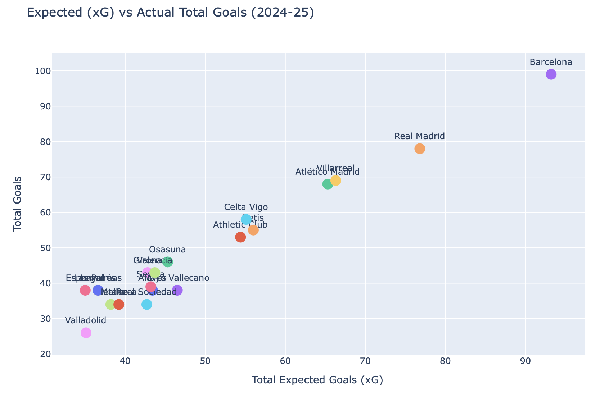

# La Liga 2024/25 - Análisis de Rendimiento de Jugadores y Equipos 🇪🇸

## Visión General
Este proyecto presenta un análisis exploratorio de datos de la temporada 2024/25 de La Liga, centrado en estadísticas tanto a nivel de jugadores como de equipos. El objetivo es descubrir tendencias, relaciones y actuaciones destacadas mediante el uso de Python y herramientas de visualización.

## Descripción del Dataset
El conjunto de datos contiene **601 jugadores únicos** e incluye métricas básicas y avanzadas.

**Características principales:**
- `Player`: Nombre del jugador
- `Nation`: Nacionalidad (código de país de 3 letras)
- `Position`: Posición principal en el campo
- `Team`: Nombre del club
- `Age`: Edad en años
- `Match`: Partidos jugados
- `Minutes`: Minutos totales jugados
- `Goals`: Goles anotados
- `Assists`: Asistencias realizadas
- `Yellow_Cards`, `Red_Cards`: Registros disciplinarios
- `xG`, `xAG`: Goles y asistencias esperadas
- `Gls/90`, `Ast/90`, `xG/90`, `xAG/90`: Métricas normalizadas por cada 90 minutos

*Nota: Algunas columnas como `xG`, `xAG` y las estadísticas por 90 minutos fueron importadas como texto y convertidas a valores numéricos para su análisis.*

## Preguntas Clave Analizadas
1. ¿Qué jugadores destacan en goles y asistencias?
2. ¿Quiénes son los más agresivos o los más utilizados?
3. ¿Existen correlaciones entre edad, tarjetas, fuerza del equipo y rendimiento?
4. ¿Qué equipos rinden por encima o por debajo de lo esperado (xG)?
5. ¿Qué revelan las estadísticas por 90 minutos sobre estilo y eficiencia?
6. ¿Qué jugadores son más versátiles según los gráficos radar?

## Visualización Destacada

## Tecnologías
- Python (Pandas, NumPy)
- Seaborn, Matplotlib, Plotly
- Google Colab

## Conclusión
Este análisis demuestra cómo los datos futbolísticos pueden ofrecer conocimientos que van más allá de estadísticas básicas como goles o asistencias. A través de análisis exploratorio y narración visual, se pueden identificar perfiles tácticos, deficiencias de eficiencia y roles creativos de jugadores. Trabajos futuros podrían incluir comparativas multitemporada, segmentación de jugadores o modelos predictivos.
